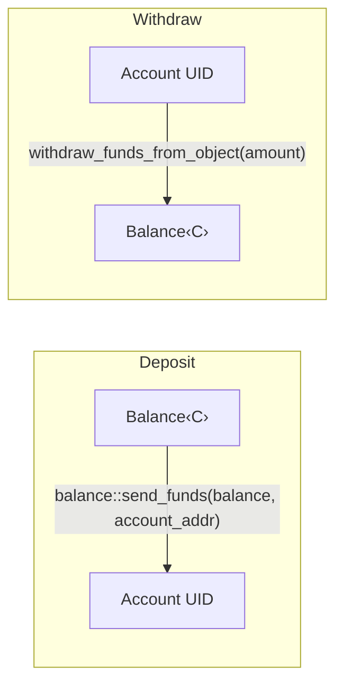

## Analysis

The external report's root cause is: **a pool/vault computes share price from a raw balance that can be inflated by direct, out-of-band asset transfers that bypass the pool's own deposit/mint accounting**, enabling a first-depositor donation attack against LSTs/LRTs.

Sui recently introduced a native primitive that reproduces exactly this trust-boundary gap: **object funds accumulators**, reachable through `sui::balance::send_funds` / `sui::funds_accumulator`.

### Finding

`sui::balance::send_funds<T>` is a fully public, unauthenticated function that lets *any* caller merge a `Balance<T>` directly into the funds accumulator of an arbitrary address — including the derived address of any object (a shared vault/pool object's `UID.to_address()`) — with zero interaction with that object's Move module: [1](#0-0) 

The accumulator write itself has no allow-list, no capability check, and no callback into the target module: [2](#0-1) [3](#0-2) 

Sui's own documentation for the PAS (Programmable Asset System) framework built on top of this primitive confirms the exact hazard: *"Deposits are permissionless (anyone can deposit into any Account)... Balances are not stored as fields on the `Account` struct."* [4](#0-3) 

Any pool, vault, staking, or LST/LRT-style contract that (a) adopts object balances / `send_funds` instead of an internally-tracked `Balance<T>` field, and (b) computes a share/exchange price as `settled_funds_value(pool_address) / total_shares_supply` (mirroring the `rsETHPrice = totalETHInPool / rsEthSupply` formula in the original report) inherits the donation-attack surface natively: an attacker can call `balance::send_funds(balance, pool_address)` to inflate the pool's observed balance with **zero shares minted**, then withdraw disproportionate value on the next legitimate deposit/redeem, or execute the classic "first depositor" inflation attack (deposit 1 wei of shares, then donate a large balance to the pool address before the next depositor arrives).

Contrast this with Sui's own object-receive model, which *does* require an explicit, module-controlled acceptance step (`transfer::receive`/`public_receive`) before a `Coin<T>`/object can affect a contract's accounted state — the funds-accumulator path has no equivalent gate at all, which is itself flagged internally as a systemic risk pattern: [5](#0-4) 

I could not find, within the indexed portion of this repository, any framework-level pool/vault (e.g., `sui-system` `staking_pool.move`) that itself uses `settled_funds_value`/object-balance accumulators for share pricing — `sui_system::staking_pool` tracks `sui_balance`/`pool_token_balance` as private struct fields mutated only by `deposit_rewards`/`process_pending_stake`, which is not reachable by unprivileged direct transfer: [6](#0-5) 

So the concrete exploitable instance is in downstream/ecosystem contracts (e.g., DeepBook Margin's `MarginPool`, or any custom lending/staking pool) that choose to rely on the new address/object-balance primitive for accounting — the root cause (a public, ungated balance-inflation entry point with no accounting rebind) lives in the `sui-framework`'s `balance`/`funds_accumulator` module itself, which is squarely in scope.

### Title
Permissionless `balance::send_funds` to an object's funds accumulator enables ERC4626-style share-price inflation for any object-balance-based pool - (File: `crates/sui-framework/packages/sui-framework/sources/balance.move`, `crates/sui-framework/packages/sui-framework/sources/funds_accumulator.move`)

### Summary
`sui::balance::send_funds<T>` allows any unprivileged caller to merge an arbitrary `Balance<T>` into the funds accumulator of any address, including addresses derived from shared pool/vault objects, without invoking or being validated by that object's Move module. Any contract that tracks pool assets via object-balance accumulators (`settled_funds_value`) instead of an internal struct field and derives share price as `assets / shares` is exposed to the classic first-depositor/donation share-inflation attack described in the source report.

### Finding Description
`send_funds` calls `funds_accumulator::add_impl`, which merges the value into `accumulator::accumulator_address<T>(recipient)` unconditionally — there is no capability check, no callback to the recipient's module, and no way for the recipient contract to reject or even be aware of the deposit until it reads `settled_funds_value` on its next call. This mirrors precisely the "unexpected amount of supported assets received without the proper function being called" root cause from the LRT report: `totalETHInPool` increases while `rsEthSupply` does not.

### Impact Explanation
Any pool contract built on Sui's object-balance model that prices shares as `settled_funds_value(pool_addr) / total_shares` can have its share price manipulated by an unprivileged attacker donating funds directly to the pool address, diluting/harming subsequent depositors or letting the attacker mint disproportionate withdrawal rights — "harmful smart-contract behavior," an allowed High-severity impact.

### Likelihood Explanation
High for any contract that adopts this new primitive for balance accounting instead of Move struct fields, since `send_funds` is a public entrypoint requiring only knowledge of the target object's address (always public on-chain) and no special capability.

### Recommendation
Pool/vault modules that need object-level balance accounting should not price shares purely from `settled_funds_value`; they must reconcile it against an internally-tracked "expected" balance updated only through their own deposit/withdraw entrypoints (or use virtual-shares/initial-mint offsets as Kelp DAO did), and treat any positive delta between observed accumulator balance and expected internal balance as a signal to require explicit reconciliation before it affects share price.

### Proof of Concept
1. Deploy (or identify) a pool `P` at address `A` that stores its asset balance via `balance::send_funds(bal, A)`/`settled_funds_value` and computes `share_price = settled_funds_value<T>(A) / total_shares`.
2. Attacker calls `P::deposit(1 wei)` to become the first depositor, minting the minimum share amount.
3. Attacker calls `sui::balance::send_funds<T>(large_balance, A)` directly — no interaction with `P`'s module is required.
4. `settled_funds_value<T>(A)` now reflects the inflated balance while `total_shares` is unchanged, inflating `share_price`.
5. Subsequent legitimate depositors receive disproportionately few shares for their deposit, while the attacker's initial shares now redeem for a proportional cut of the donated funds.

### Citations

**File:** crates/sui-framework/packages/sui-framework/sources/balance.move (L101-104)
```text
/// Send a `Balance` to an address's funds accumulator.
public fun send_funds<T>(balance: Balance<T>, recipient: address) {
    sui::funds_accumulator::add_impl(balance, recipient);
}
```

**File:** crates/sui-framework/packages/sui-framework/sources/funds_accumulator.move (L35-44)
```text
/// Allows for withdrawing funds from a given address. The `Withdrawal` can be created in PTBs for
/// the transaction sender, or dynamically from an object via `withdraw_from_object`.
/// The redemption of the funds must be initiated from the module that defines `T`.
public struct Withdrawal<phantom T: store> has drop {
    /// The owner of the funds, either an object or a transaction sender
    owner: address,
    /// At signing we check the limit <= balance when taking this as a call arg.
    /// If this was generated from an object, we cannot check this until redemption.
    limit: u256,
}
```

**File:** crates/sui-framework/docs/sui/funds_accumulator.md (L291-310)
```markdown
<a name="sui_funds_accumulator_add_impl"></a>

## Function `add_impl`


<pre><code><b>public</b>(<a href="../sui/package.md#sui_package">package</a>) <b>fun</b> <a href="../sui/funds_accumulator.md#sui_funds_accumulator_add_impl">add_impl</a>&lt;T: store&gt;(value: T, recipient: <b>address</b>)
</code></pre>


<details>
<summary>Implementation</summary>


<pre><code><b>public</b>(<a href="../sui/package.md#sui_package">package</a>) <b>fun</b> <a href="../sui/funds_accumulator.md#sui_funds_accumulator_add_impl">add_impl</a>&lt;T: store&gt;(value: T, recipient: <b>address</b>) {
    <b>let</b> <a href="../sui/accumulator.md#sui_accumulator">accumulator</a> = <a href="../sui/accumulator.md#sui_accumulator_accumulator_address">sui::accumulator::accumulator_address</a>&lt;T&gt;(recipient);
    <a href="../sui/funds_accumulator.md#sui_funds_accumulator_add_to_accumulator_address">add_to_accumulator_address</a>&lt;T&gt;(<a href="../sui/accumulator.md#sui_accumulator">accumulator</a>, recipient, value)
}
</code></pre>
```

**File:** docs/content/onchain-finance/pas/pas-architecture.mdx (L182-212)
```text
## Balance tracking

PAS uses Sui [Address Balances](/onchain-finance/asset-custody/address-balances/using-address-balances):

### How balances are stored

The following diagram shows how balances attach to an Account:

```
Account (shared object)
  └── UID
       └── Balance<MY_COIN> stored via balance::send_funds(balance, account_object_address)
```

Balances are not stored as fields on the `Account` struct. They are stored as object balance on the Account UID, using `balance::send_funds` to send funds to the Account object address and `balance::withdraw_funds_from_object` (through `UID.withdraw_funds_from_object`) to pull them out.

### Balance flow

The following diagram shows deposit and withdrawal paths:



Deposits are permissionless (anyone can deposit into any Account). Withdrawals are internal (`public(package)`). Only PAS modules can withdraw, and only through requests.
```

**File:** crates/sui-prompt/src/skills/sui-move-security-review/object-lifecycle.md (L40-48)
```markdown
### SM-C4 — Unvalidated `Receiving<T>` acceptance   [Medium]
Invariant: `transfer::receive` / `public_receive` validates the received object's type and/or
sender before accepting it into the parent.
Detect: blind `receive` loops or accepting `Receiving<T>` without checking provenance.
_Absence rule:_ walk every `transfer::receive`/`public_receive` call site; a single
unchecked receive is the finding.
Exploit: spam an account/object with crafted objects → inventory pollution, type-handling
confusion, or storage griefing.
Source: `MystenLabs/skills → object-model/transfers.md`.
```

**File:** crates/sui-framework/packages/sui-system/sources/staking_pool.move (L349-353)
```text
/// Called at epoch advancement times to add rewards (in SUI) to the staking pool.
public(package) fun deposit_rewards(pool: &mut StakingPool, rewards: Balance<SUI>) {
    pool.sui_balance = pool.sui_balance + rewards.value();
    pool.rewards_pool.join(rewards);
}
```
