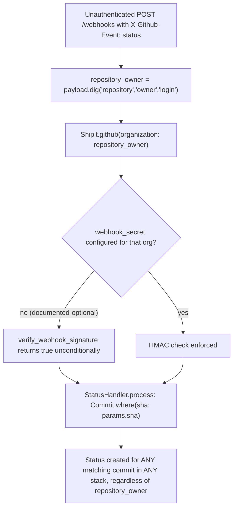

Confirmed: `Commit` has no default scope tying lookups to a stack/repository, so `Commit.where(sha: params.sha)` in `StatusHandler` truly spans every stack in the Shipit instance.

### Title
Webhook status handler binds signature verification to attacker-controlled `repository.owner.login`, but writes commit status by SHA with no repository scoping, enabling cross-repository forged CI status and unauthorized deploys - (File: app/controllers/shipit/webhooks_controller.rb, app/models/shipit/webhooks/handlers/status_handler.rb)

### Summary
`WebhooksController#verify_signature` selects which GitHub App/organization's webhook secret to use for HMAC verification based on `repository_owner`, a value parsed straight out of the unauthenticated JSON body [1](#0-0) . In multi-organization deployments, `Shipit.github(organization:)` uses that attacker-supplied organization name to pick the app config, and if that organization is configured without a `webhook_secret` (an explicitly documented, optional setting), `verify_webhook_signature` returns `true` unconditionally regardless of the actual signature [2](#0-1) . Separately, `StatusHandler#process` writes a new `Status` for a commit purely by matching `sha` across the entire `Commit` table, with no check that the commit's stack/repository corresponds to the organization that was used to authenticate the request [3](#0-2) . This breaks the equality: `organization whose credentials authenticated the webhook == repository/stack whose commit-status record is written`.

### Finding Description
The webhook flow is:



- `repository_owner` is derived from `params.dig('repository', 'owner', 'login')` (fallback `organization.login`) before any signature check occurs, so it is fully attacker-controlled at the point it is used to select the verification key. [4](#0-3) 
- `Shipit.github(organization:)` in multi-org mode raises `GithubOrganizationUnknown` only if the named organization doesn't exist in the config; if it exists but has `webhook_secret: nil` — a state explicitly shown as valid in the shipped example configs — signature verification is bypassed entirely. [5](#0-4) [6](#0-5) 
- `StatusHandler`, unlike `PushHandler` (which correctly scopes via `stacks.not_archived.where(branch:)` derived from `repository_name` = `payload.dig('repository','full_name')`), never uses the `stacks`/`repository_name` scoping inherited from `Handler`. It queries `Commit.where(sha: params.sha)` directly, spanning every stack tracked by the whole Shipit instance. [7](#0-6) [8](#0-7) [9](#0-8) 
- `Commit` has no tenant/stack-based default scope, so any commit row in the database, belonging to any stack/repository, can match. [10](#0-9) 
- Creating a `Status` triggers `enable_ci_on_stack` and `schedule_continuous_delivery` on the commit, which — if that stack has `continuous_deployment: true` — schedules `ContinuousDeliveryJob`, which can invoke `stack.trigger_continuous_delivery` → `trigger_deploy`. [11](#0-10) [12](#0-11) [13](#0-12) 

Before the attacker's request: the equality holds only in appearance — the code assumes the organization used to select/verify the webhook secret is the same organization whose repository data will be mutated. After the attacker's request: an entity with no relationship whatsoever to the target repository can, with zero credentials, cause a `Status` row (`state: success`) to be attached to a commit belonging to a target stack merely by knowing its SHA (public information for public repos, or discoverable via any leaked commit URL) and by naming, in the forged JSON body, any organization that is configured in `secrets.github` without a `webhook_secret`.

### Impact Explanation
This crosses the "unauthorized deploy" impact category: a forged, entirely unauthenticated HTTP request can inject a fake "CI success" status for a commit belonging to an unrelated, properly-secured repository/organization, which (combined with `continuous_deployment: true`) can trigger an actual, unauthorized deploy of that commit — bypassing GitHub's own commit-status authorization model completely. Even without continuous deployment, it corrupts the deployability signal (`Commit#deployable?`) that gates manual deploys and merges for stacks the attacker has no legitimate access to, which functions as authorization bypass of the CI-gate that stands between an unprivileged party and a ship/merge action.

### Likelihood Explanation
Exploitation requires: (1) the deployment to use the documented multi-organization GitHub App configuration with at least one entry lacking `webhook_secret` (shown as a valid/example configuration in the shipped `config/secrets.development.shopify.yml` and `docs/setup.md`), and (2) knowledge of a target commit SHA, which is public for open-source repositories deployed via Shipit. No GitHub credentials, Shipit session, ApiClient token, or repository write access of any kind is required — only an HTTP POST to the public `/webhooks` endpoint. The `StatusHandler` scoping gap itself is unconditional and present in every deployment mode.

### Recommendation
- In `StatusHandler#process`, scope the `Commit` lookup to `stacks` (derived from the verified `repository_name`/`repository_owner`), mirroring `PushHandler`, instead of matching bare `sha` across the whole table.
- In `Shipit.github`, always require and enforce a non-blank `webhook_secret` per organization in multi-org mode, or fail closed (reject the webhook) instead of treating a missing secret as "signature verification not required."
- Ensure `repository_owner` used for choosing the verification key is cross-checked against the `repository.full_name`/org actually referenced by the event payload before any handler is allowed to mutate state for that repository.

### Proof of Concept
Given a multi-org config such as:
```yaml
github:
  AttackerOrg:
    webhook_secret: # nil, per documented optional setting
  TargetOrg:
    webhook_secret: "real-secret"
```
1. Discover (or already know) the SHA of a commit tracked by a `TargetOrg` stack (e.g., from the public GitHub repo history).
2. Send, with no authentication/session/token of any kind:
```
POST /webhooks HTTP/1.1
X-Github-Event: status

{
  "repository": {"owner": {"login": "AttackerOrg"}, "full_name": "AttackerOrg/anything"},
  "sha": "<target commit sha>",
  "state": "success",
  "context": "ci/travis"
}
```
3. `verify_signature` resolves `Shipit.github(organization: "AttackerOrg")`, whose `webhook_secret` is blank, so `verify_webhook_signature` returns `true` unconditionally regardless of any `X-Hub-Signature` header (or its absence). [2](#0-1) 
4. `StatusHandler.process` finds the `TargetOrg` commit purely by SHA and creates a `success` `Status` on it. [3](#0-2) 
5. If the `TargetOrg` stack has `continuous_deployment: true`, this schedules and can execute an unauthorized deploy of that commit. [12](#0-11)

### Citations

**File:** app/controllers/shipit/webhooks_controller.rb (L24-30)
```ruby
    def verify_signature
      github_app = Shipit.github(organization: repository_owner)
      verified = github_app.verify_webhook_signature(
        request.headers['X-Hub-Signature'],
        request.raw_post
      )
      head(422) unless verified
```

**File:** app/controllers/shipit/webhooks_controller.rb (L59-62)
```ruby
    def repository_owner
      # Fallback to the organization sub-object if repository isn't included in the payload
      params.dig('repository', 'owner', 'login') || params.dig('organization', 'login')
    end
```

**File:** lib/shipit/github_app.rb (L76-83)
```ruby
    def verify_webhook_signature(signature, message)
      return true unless webhook_secret

      algorithm, signature = signature.split("=", 2)
      return false unless algorithm == 'sha1'

      SecureCompare.secure_compare(signature, OpenSSL::HMAC.hexdigest(algorithm, webhook_secret, message))
    end
```

**File:** app/models/shipit/webhooks/handlers/status_handler.rb (L1-25)
```ruby
# frozen_string_literal: true

module Shipit
  module Webhooks
    module Handlers
      class StatusHandler < Handler
        params do
          requires :sha, String
          requires :state, String
          accepts :description, String
          accepts :target_url, String
          accepts :context, String
          accepts :created_at, String

          accepts :branches, Array do
            requires :name, String
          end
        end

        def process
          Commit.where(sha: params.sha).each do |commit|
            commit.create_status_from_github!(params)
          end
        end
      end
```

**File:** lib/shipit.rb (L170-200)
```ruby
  def github(organization: github_default_organization)
    # Backward compatibility
    # nil signifies the single github app config schema is being used
    if github_default_organization.nil?
      config = secrets.github
    else
      config = github_app_config(organization)
      raise GithubOrganizationUnknown, organization if config.nil?
    end
    @github ||= {}
    @github[organization] ||= GitHubApp.new(organization, config)
  end

  def github_default_organization
    return nil unless secrets&.github

    org = secrets.github.keys.first
    TOP_LEVEL_GH_KEYS.include?(org) ? nil : org
  end

  def github_organizations
    return [nil] unless github_default_organization

    secrets.github.keys
  end

  def github_app_config(organization)
    github_config = secrets.github.deep_transform_keys(&:downcase)
    github_organization = organization.downcase.to_sym
    github_config[github_organization]
  end
```

**File:** config/secrets.development.shopify.yml (L1-23)
```yaml
host: 'shipit-engine.myshopify.io'

# For creating an app see: https://github.com/Shopify/shipit-engine/blob/main/docs/setup.md#creating-the-github-app

github:
  somegithuborg:
    app_id:
    installation_id:
    webhook_secret: # nil
    private_key:
    oauth:
      id:
      secret:
      teams:
  someothergithuborg:
    app_id:
    installation_id:
    webhook_secret: # nil
    private_key:
    oauth:
      id:
      secret:
      teams:
```

**File:** app/models/shipit/webhooks/handlers/handler.rb (L32-38)
```ruby
        def stacks
          @stacks ||= Repository.from_github_repo_name(repository_name)&.stacks || Stack.none
        end

        def repository_name
          payload.dig('repository', 'full_name')
        end
```

**File:** app/models/shipit/webhooks/handlers/push_handler.rb (L12-17)
```ruby
        def process
          stacks
            .not_archived
            .where(branch:)
            .find_each { |stack| stack.sync_github(expected_head_sha: params.after) }
        end
```

**File:** app/models/shipit/commit.rb (L1-18)
```ruby
# frozen_string_literal: true

module Shipit
  class Commit < Record
    include DeferredTouch

    RECENT_COMMIT_THRESHOLD = 10.seconds

    AmbiguousRevision = Class.new(StandardError)

    belongs_to :stack
    has_many :statuses, -> { order(created_at: :desc) }, dependent: :destroy, inverse_of: :commit
    has_many :check_runs, -> { order(created_at: :desc) }, dependent: :destroy, inverse_of: :commit
    has_many :commit_deployments, dependent: :destroy
    has_many :release_statuses, dependent: :destroy
    belongs_to :merge_request, inverse_of: :merge_commit, optional: true

    deferred_touch stack: :updated_at
```

**File:** app/models/shipit/commit.rb (L281-287)
```ruby
    def schedule_continuous_delivery
      return unless deployable? && stack.continuous_deployment? && stack.deployable?

      # This buffer is to allow for statuses and checks to be refreshed before evaluating if the commit is deployable
      # - e.g. if the commit was fast-forwarded with already passing CI.
      ContinuousDeliveryJob.set(wait: RECENT_COMMIT_THRESHOLD).perform_later(stack)
    end
```

**File:** app/models/shipit/status.rb (L18-44)
```ruby
    after_create :enable_ci_on_stack
    after_commit :schedule_continuous_delivery, :broadcast_update, on: :create

    delegate :broadcast_update, to: :commit

    class << self
      def replicate_from_github!(stack_id, github_status)
        find_or_create_by!(
          stack_id:,
          state: github_status.state,
          description: github_status.description,
          target_url: github_status.target_url,
          context: github_status.context,
          created_at: github_status.created_at
        )
      end
    end

    private

    def enable_ci_on_stack
      commit.stack.enable_ci!
    end

    def schedule_continuous_delivery
      commit.schedule_continuous_delivery
    end
```

**File:** app/models/shipit/stack.rb (L210-229)
```ruby
    def trigger_continuous_delivery
      return if cached_deploy_spec.blank?

      commit = next_commit_to_deploy

      if should_resume_continuous_delivery?(commit)
        continuous_delivery_resumed!
        return
      end

      if should_delay_continuous_delivery?(commit)
        continuous_delivery_delayed!
        return
      end

      begin
        trigger_deploy(commit, Shipit.user, env: cached_deploy_spec.default_deploy_env)
      rescue Task::ConcurrentTaskRunning
      end
    end
```
